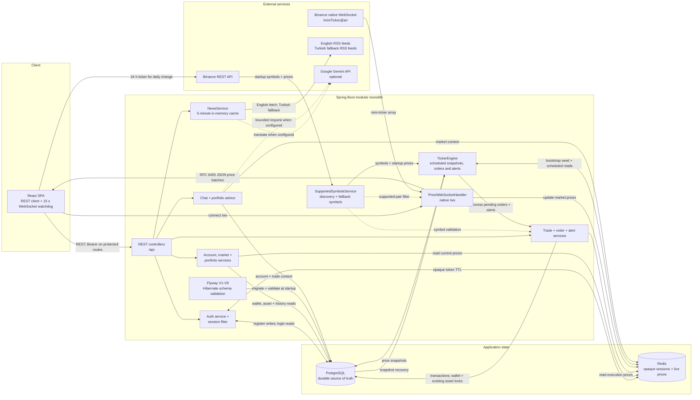

# CryptFlow

CryptFlow is a paper-trading application for learning cryptocurrency portfolio management without moving real funds. It combines a React single-page application with a Spring Boot API, PostgreSQL persistence, Redis-backed prices and opaque login sessions, native JSON WebSocket market updates, scheduled orders and alerts, RSS news, and optional Google Gemini analysis.

- **Live application:** **TODO — supply the deployed application URL manually.** No live deployment URL is stored in this repository.
- **GitHub repository:** [dkivrak/i2i-Systems--CryptFlow](https://github.com/dkivrak/i2i-Systems--CryptFlow)

## Technology stack

Versions below come from the executable manifests and lockfile in this repository.

| Area | Technology |
|---|---|
| Frontend | React 19.2.7, React Router 7.18.1, Vite 7.3.6, Tailwind CSS 3.4.19 |
| Frontend libraries | i18next 26.3.6, react-i18next 17.0.10, react-markdown 10.1.0 |
| Frontend quality | ESLint 9.39.5, Vitest 3.2.7, Testing Library |
| Backend | Java 21, Spring Boot 3.5.3, Maven |
| Backend libraries | Spring MVC, WebFlux `WebClient`, WebSocket, Security, Validation, Data JPA, Data Redis, Flyway |
| API documentation | springdoc-openapi 2.8.9 / OpenAPI 3 / Swagger UI |
| Infrastructure | `postgres:17-alpine`, `redis:7-alpine`, Docker Compose |
| External services | Binance REST and native WebSocket APIs, Google Gemini, English and Turkish RSS feeds |

The price and equity charts are repository-native SVG components. The project does not use Lightweight Charts.

## Architecture and data flow

The backend is a feature-oriented modular monolith. Authentication, chat, market (including alerts), portfolio, trade (including orders), user, wallet, WebSocket, and shared infrastructure code live in focused packages under `backend/src/main/java/com/i2i/cryptflow`. These packages are compiled and deployed as one Spring Boot application; they are not independently deployed services.



Solid arrows show runtime data paths. Dashed arrows show policy or optional integration paths.

### Flow breakdown

1. At startup, the backend asks Binance REST for current USDT pairs and prices. If Binance is unavailable, it uses a ten-symbol fallback list; missing Redis prices are seeded from a fetched startup price when available or `1.00` otherwise. Stored snapshots and the three configured initial prices are secondary recovery inputs if the ticker must rebuild state after a current-price read fails.
2. `GET /api/market/prices` reads the latest price hash from Redis. The browser also requests Binance's 24-hour ticker directly to calculate daily-open comparisons.
3. When at least one browser connects to `/ws`, the backend opens Binance's `!miniTicker@arr` native WebSocket stream, filters supported USDT pairs, updates Redis, and broadcasts JSON price batches. It reconnects after an upstream connection failure or close. The upstream socket is released after the last browser disconnects.
4. The React client marks market data stale when no valid price message arrives for 15 seconds and reconnects its browser socket after close or error. The backend does not implement a separate time-based stale-message watchdog.
5. The configurable ticker task snapshots current Redis prices to PostgreSQL and processes pending orders and alerts. It does not generate simulated price fluctuations.
6. Trades run inside database transactions. Wallet and existing portfolio-asset rows are loaded with pessimistic write locks before balances and holdings are changed.
7. Registration, portfolios, trades, orders, alerts, equity history, and price history are persisted in PostgreSQL. Opaque UUID login tokens map to user IDs in Redis and expire after the configured TTL.
8. English news comes from CoinDesk and Cointelegraph RSS feeds. Turkish news is translated from the English set through Gemini when configured, with direct Turkish RSS feeds as the failure fallback. Successful results are cached in memory for five minutes.
9. Chat and portfolio advice assemble account, portfolio, trade, and market context before making a bounded synchronous Gemini request. Gemini is optional; exact failure behavior is documented below.

## Repository structure

```text
.
├── .env.example                    # Docker Compose environment template
├── docker-compose.yml              # PostgreSQL, Redis, and backend
├── backend/
│   ├── Dockerfile
│   ├── pom.xml
│   └── src/
│       ├── main/java/com/i2i/cryptflow/
│       │   ├── auth/ chat/ market/ portfolio/ trade/
│       │   ├── user/ wallet/ websocket/
│       │   └── shared/             # configuration, errors, models, security
│       ├── main/resources/
│       │   ├── application.yml
│       │   └── db/migration/       # Flyway V1 through V8
│       └── test/java/
└── frontend/
    ├── .env.example                # Vite environment template
    ├── package.json
    ├── package-lock.json
    ├── vite.config.js
    └── src/                        # React source and tests
```

## Prerequisites

- Git
- Docker Engine with Docker Compose v2 (`docker compose`)
- Node.js `^20.19.0` or `>=22.12.0` and npm, as required by the locked Vite version
- Java 21 and Maven 3.9+ for running backend tests or Maven commands on the host

The repository does not contain a Maven Wrapper; use the installed `mvn` command.

## Clone and configure

```bash
git clone https://github.com/dkivrak/i2i-Systems--CryptFlow.git
cd i2i-Systems--CryptFlow
cp .env.example .env
```

The root `.env` file is read by Docker Compose and is Git-ignored. Its placeholder database password is suitable only for isolated local development. Leave `GEMINI_API_KEY` blank if Gemini features are not needed.

For frontend defaults, create its local Vite environment file:

```bash
cp frontend/.env.example frontend/.env
```

### Backend and infrastructure variables

| Variable | Template/default | Purpose |
|---|---|---|
| `POSTGRES_DB` | `cryptflow` | Database created by the PostgreSQL container |
| `POSTGRES_USER` | `cryptflow` | PostgreSQL container user |
| `POSTGRES_PASSWORD` | `change-me` | PostgreSQL container password; replace outside isolated local use |
| `POSTGRES_PORT` | `5432` | PostgreSQL host port mapped to container port 5432 |
| `SPRING_DATASOURCE_URL` | `jdbc:postgresql://postgres:5432/cryptflow` | Backend JDBC URL inside the Compose network |
| `SPRING_DATASOURCE_USERNAME` | `cryptflow` | Backend JDBC username; keep aligned with the database user |
| `SPRING_DATASOURCE_PASSWORD` | `change-me` | Backend JDBC password; keep aligned with the database password |
| `SPRING_DATA_REDIS_HOST` | `redis` | Redis hostname inside the Compose network |
| `SPRING_DATA_REDIS_PORT` | `6379` | Redis service port |
| `SESSION_TTL_HOURS` | `24` | Lifetime of an opaque login token in Redis |
| `FRONTEND_ORIGINS` | `http://localhost:5173,http://127.0.0.1:5173` | Comma-separated HTTP CORS and WebSocket origins |
| `GEMINI_API_KEY` | blank | Optional Gemini API credential; never commit a real value |
| `GEMINI_MODEL` | `gemini-3.1-flash-lite` | Gemini model used by chat, advice, and Turkish translation |
| `GEMINI_TIMEOUT_SECONDS` | `15` | Maximum synchronous wait for a Gemini response |
| `TICKER_INTERVAL_MS` | `15000` | Delay between snapshot/order/alert processing runs |
| `TICKER_INITIAL_BTC_PRICE` | `60000.00` | BTC recovery fallback if the ticker rebuilds state and live/stored prices are unavailable |
| `TICKER_INITIAL_ETH_PRICE` | `3000.00` | ETH recovery fallback if the ticker rebuilds state and live/stored prices are unavailable |
| `TICKER_INITIAL_SOL_PRICE` | `150.00` | SOL recovery fallback if the ticker rebuilds state and live/stored prices are unavailable |

### Frontend variables

| Variable | Default | Purpose |
|---|---|---|
| `VITE_API_BASE_URL` | `http://localhost:8080/api` | REST API base URL compiled into the Vite client |
| `VITE_WS_URL` | `ws://localhost:8080/ws` | Native market WebSocket URL compiled into the Vite client |

Vite exposes only variables prefixed with `VITE_`. Restart the dev server after changing them.

## Start the backend infrastructure with Docker Compose

The Compose project starts PostgreSQL, Redis, and the Spring Boot backend. It does **not** build or run the React frontend.

From the repository root:

```bash
docker compose config
docker compose up -d --build
docker compose ps
```

PostgreSQL and Redis have health checks. The backend waits for both services to become healthy, then Flyway applies pending migrations and Hibernate validates the resulting schema with `ddl-auto=validate`.

Useful backend logs:

```bash
docker compose logs --no-color postgres
docker compose logs --no-color redis
docker compose logs --no-color backend
```

## Start the frontend locally

In a second terminal, from the repository root:

```bash
cd frontend
npm ci
npm run dev
```

`npm ci` installs exactly the versions recorded in `frontend/package-lock.json`.

## Local URLs

| Service | URL |
|---|---|
| Frontend | `http://localhost:5173` |
| Backend | `http://localhost:8080` |
| Swagger UI | `http://localhost:8080/swagger-ui.html` |
| OpenAPI JSON | `http://localhost:8080/v3/api-docs` |
| Market WebSocket | `ws://localhost:8080/ws` |
| PostgreSQL | `localhost:5432` by default |
| Redis | `localhost:6379` |

## Authentication

CryptFlow uses an opaque UUID session token, not a JWT.

1. Register with `POST /api/auth/register`.
2. Log in with `POST /api/auth/login` and copy the `token` field from the response.
3. For a direct HTTP client, send `Authorization: Bearer <token>` on protected requests.
4. In Swagger UI, click **Authorize**, enter the token value, and authorize the HTTP Bearer scheme. Swagger UI adds the `Bearer` prefix.
5. `POST /api/auth/logout` removes the token from Redis. The same token then receives `401 Unauthorized` on protected endpoints.

Tokens expire after `SESSION_TTL_HOURS`. Registration, login, current market prices, and news are the only public REST operations. Swagger/OpenAPI and the `/ws` handshake are also publicly reachable.

## REST API overview

| Access | Method | Path | Success | Purpose |
|---|---|---|---|---|
| Public | `POST` | `/api/auth/register` | `201` | Create an account and virtual USD wallet |
| Public | `POST` | `/api/auth/login` | `200` | Create an opaque Redis-backed session token |
| Protected | `POST` | `/api/auth/logout` | `204` | Invalidate the current token |
| Protected | `GET` | `/api/me` | `200` | Return the current account and USD balance |
| Protected | `POST` | `/api/me/change-password` | `200` | Change the current password |
| Protected | `DELETE` | `/api/me` | `200` | Delete the current account and owned core records |
| Public | `GET` | `/api/market/prices` | `200` | Return current Redis-backed prices |
| Protected | `GET` | `/api/market/history/{symbol}` | `200` | Return up to 40 recent stored price snapshots |
| Public | `GET` | `/api/news?lang=en` | `200` | Return English or Turkish (`lang=tr`) news |
| Protected | `GET` | `/api/portfolio` | `200` | Return cash, holdings, valuations, and total value |
| Protected | `GET` | `/api/portfolio/ai-advice?lang=en&force=false` | `200` | Return cached or refreshed Gemini portfolio advice |
| Protected | `GET` | `/api/portfolio/equity-history` | `200` | Return stored equity points |
| Protected | `POST` | `/api/trades` | `201` | Execute a market buy or sell |
| Protected | `GET` | `/api/trades?page=0&size=20` | `200` | Return paginated trade history; size is capped at 100 |
| Protected | `POST` | `/api/orders` | `201` | Create a limit or stop-loss order |
| Protected | `GET` | `/api/orders` | `200` | List pending orders |
| Protected | `GET` | `/api/orders/history` | `200` | List executed and cancelled orders |
| Protected | `DELETE` | `/api/orders/{id}` | `204` | Cancel an owned pending order |
| Protected | `POST` | `/api/alerts` | `201` | Create an `ABOVE` or `BELOW` price alert |
| Protected | `GET` | `/api/alerts` | `200` | List active alerts |
| Protected | `GET` | `/api/alerts/triggered` | `200` | List triggered alerts |
| Protected | `DELETE` | `/api/alerts/{id}` | `204` | Delete an owned alert |
| Protected | `POST` | `/api/chat/query` | `200` | Ask the contextual Gemini assistant |

Swagger UI contains request/response schemas, validation constraints, examples, expected error responses, and the Bearer authorization control. The API uses a consistent error shape:

```json
{
  "code": "VALIDATION_ERROR",
  "message": "Please check the submitted fields.",
  "timestamp": "2026-01-01T00:00:00Z",
  "fieldErrors": [
    { "field": "email", "message": "must be a well-formed email address" }
  ]
}
```

Typical statuses are `400` for validation or malformed input, `401` for missing/invalid/expired sessions, `403` for an object owned by another account, `404` for missing resources, `409` for duplicate registration, `422` for insufficient cash or holdings, and `503` when a required Gemini call is unavailable.

## Gemini behavior

`GEMINI_API_KEY` is not required to start the application or use authentication, market data, portfolios, trades, orders, alerts, or English news.

- Without a valid Gemini configuration, `POST /api/chat/query` and `GET /api/portfolio/ai-advice` return HTTP `503` with `code: "GEMINI_UNAVAILABLE"`.
- For `GET /api/news?lang=tr`, a Gemini translation failure is caught and Turkish RSS feeds are used instead. If those external feeds are also unreachable, the result can be empty.
- Successful chat answers include the educational disclaimer: `Educational purposes only — not financial advice.`
- The current Gemini prompt includes account and portfolio context. Review this data flow before enabling the feature in a non-local environment.

## Native WebSocket protocol

Connect to `ws://localhost:8080/ws` with a standard RFC 6455 WebSocket client. The endpoint does not use STOMP or SockJS and does not require a subscription frame. The browser's `Origin` must match `FRONTEND_ORIGINS`.

The server sends JSON arrays containing the symbol and decimal price as strings:

```json
[
  { "s": "BTC", "p": "60000.12000000" },
  { "s": "ETH", "p": "3000.34000000" }
]
```

Supported symbols are the valid USDT pairs loaded from Binance at startup. If that startup request fails, the fallback list is `BTC`, `ETH`, `SOL`, `BNB`, `ADA`, `XRP`, `DOGE`, `DOT`, `AVAX`, and `LINK`.

## Database and Flyway

Migration files are stored at the repository-root path:

```text
backend/src/main/resources/db/migration
```

Flyway records each applied version exactly once in `flyway_schema_history`. Docker Compose does not mount schema SQL directly into PostgreSQL; the Spring Boot backend runs Flyway during startup.

| Version | Script | Change |
|---|---|---|
| V1 | `V1__initial_schema.sql` | Creates `users`, `wallets`, `portfolio_assets`, `trade_transactions`, and `price_snapshots`, with core keys, checks, uniqueness, and indexes |
| V2 | `V2__add_new_symbols.sql` | Expands the original fixed-symbol CHECK constraints |
| V3 | `V3__remove_symbol_constraints.sql` | Removes fixed-symbol constraints so Binance-discovered symbols can be stored |
| V4 | `V4__widen_symbol_column.sql` | Widens the original market, trade, and portfolio-asset symbol columns |
| V5 | `V5__increase_price_precision.sql` | Changes snapshot and executed-trade unit-price columns to `NUMERIC(28,8)` |
| V6 | `V6__premium_features_schema.sql` | Adds portfolio average price, `equity_history`, `limit_orders`, and `price_alerts` |
| V7 | `V7__add_triggered_at_to_alerts.sql` | Adds `price_alerts.triggered_at` |
| V8 | `V8__premium_schema_integrity.sql` | Widens premium-feature symbols, adds domain/positivity checks, and indexes order/alert ownership queries |

The resulting application tables are `users`, `wallets`, `portfolio_assets`, `trade_transactions`, `price_snapshots`, `equity_history`, `limit_orders`, and `price_alerts`.

## Tests and builds

Backend, from the repository root:

```bash
cd backend
mvn clean test
mvn clean package
```

Frontend, from the repository root in a separate shell:

```bash
cd frontend
npm ci
npm run lint
npm run test
npm run build
```

A successful unit test or build does not by itself prove that PostgreSQL, Redis, Binance, Gemini, WebSocket, and browser integration are available. Use the Docker startup and API smoke checks for runtime verification.

## Stop or reset the local stack

Run these commands from the repository root. Open a new shell or run `cd ..` first if the current shell is still in `frontend/`.

Stop containers while preserving the PostgreSQL volume:

```bash
docker compose down --remove-orphans
```

Delete containers and the local PostgreSQL volume, then rebuild from an empty database:

```bash
docker compose down -v --remove-orphans
docker compose up -d --build
```

The `-v` command permanently removes the Compose-managed local database volume. Do not use it if that data must be retained.

## Troubleshooting

### Port conflicts

- Change `POSTGRES_PORT` in `.env` if host port 5432 is occupied.
- Redis, backend, and frontend default to host ports 6379, 8080, and 5173. Stop the conflicting process or deliberately update Compose and the matching frontend URLs/origins.

### PostgreSQL or Redis is unhealthy

```bash
docker compose ps
docker compose logs --no-color postgres
docker compose logs --no-color redis
docker compose logs --no-color backend
```

Keep `POSTGRES_*` and `SPRING_DATASOURCE_*` credentials aligned. PostgreSQL initialization values are applied only when its data directory is empty; use the documented volume reset only when losing local data is acceptable.

### Binance is unavailable

The startup REST request falls back to a fixed symbol list, but live WebSocket prices still require outbound access to Binance. Check backend logs, DNS, firewall, proxy, and regional access. The frontend reports stale/offline data when valid messages stop; an environmental Binance restriction is not automatically a database or Redis failure.

### Gemini is unavailable

Confirm that `GEMINI_API_KEY`, `GEMINI_MODEL`, and `GEMINI_TIMEOUT_SECONDS` are valid for the configured Google account. Core trading remains available without Gemini; chat/advice return the documented 503 and Turkish news attempts its RSS fallback.

### Browser requests are blocked

Ensure the exact frontend origin is included in `FRONTEND_ORIGINS`, then rebuild/restart the backend. Keep `VITE_API_BASE_URL` and `VITE_WS_URL` aligned with the backend host and protocol; HTTPS frontends require HTTPS/WSS endpoints in deployment.

## Security notes

- Never commit `.env`, API keys, production database credentials, access tokens, private data dumps, or logs containing sensitive data.
- Replace all placeholder credentials outside isolated local development and use a secret manager for deployment.
- Use HTTPS and WSS in any deployed environment; the documented HTTP/WS URLs are local-development defaults.
- Treat the Redis UUID token as a credential and do not paste it into reports, logs, screenshots, or source files.
- This application performs paper trading only. Gemini output is educational and is not financial advice.
