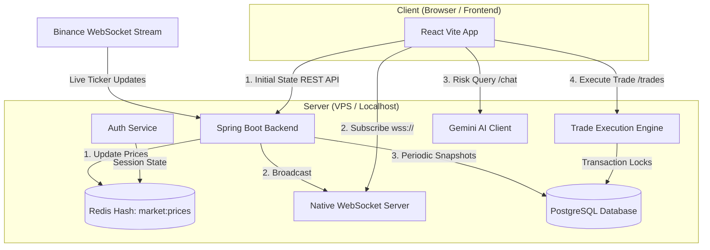

# CryptFlow - Virtual Trading & Portfolio Analyzer

CryptFlow is a paper-trading web application that integrates real-time market data from Binance, allowing users to test trading strategies using a virtual USD balance without financial risk. It features portfolio diagnostics and risk insights powered by Gemini AI.

---

## Features

* **Binance WebSocket Integration:** The backend connects to the Binance WebSocket stream (`!miniTicker@arr`) to track over 620 USDT trading pairs, updating prices in memory within milliseconds.
* **Real-time Price Stream:** The React frontend connects to the backend via a native WebSocket connection to receive live price updates. Price shifts are highlighted in the UI using clean visual change animations.
* **Reliable Token Logos:** Logos are loaded from a primary GitHub cryptocurrency icon repository, falling back automatically to the CoinCap API if a token is not found, before defaulting to a gradient letter avatar.
* **Safe Trade Execution:** Balances and asset holdings are locked using Database Pessimistic Write Locks within a single transaction, ensuring ACID compliance and preventing race conditions.
* **AI Portfolio Analytics:** Users can ask the integrated Gemini AI assistant for portfolio breakdowns, risk estimation, and market suggestions based on their current holdings.
* **Transaction Ledger:** Every transaction is logged in the database and displayed in the frontend with pagination support.

---

## Architecture & Data Flow

The following diagram illustrates how live market data flows from Binance down to the PostgreSQL database and React frontend, alongside the transaction and chat execution paths:



### Data Flow Execution:
1. **Market Tickers:**
   * The backend reads price data from the Binance WebSocket connection.
   * Latest prices are written to a Redis hash (`market:prices`).
   * Connected WebSocket clients receive the update payload immediately.
   * A background scheduler (`TickerEngine`) writes snapshots of these prices to PostgreSQL every 15 seconds for historical analysis.
2. **Order Execution:**
   * When a buy or sell request is posted to `/api/trades`, the database record for the user's portfolio and asset rows are locked using `PESSIMISTIC_WRITE`.
   * Checks for sufficient cash or asset quantity are run against live prices.
   * If validated, balances are adjusted, the trade is logged, and the transaction commits, releasing the locks.

---

## Database Schema

Database migrations are managed automatically via Flyway. The core tables are structured as follows:

### 1. `users`
* `id` (UUID, Primary Key): Unique user ID.
* `first_name` (VARCHAR): User first name.
* `last_name` (VARCHAR): User last name.
* `email` (VARCHAR, Unique): Login email address.
* `password` (VARCHAR): BCrypt password hash.

### 2. `portfolio`
* `id` (UUID, Primary Key): Portfolio ID.
* `user_id` (UUID, Foreign Key): Reference to the owner.
* `usd_balance` (NUMERIC): Available USD virtual cash (starts at $10,000.00).

### 3. `portfolio_assets`
* `id` (UUID, Primary Key): Asset record ID.
* `portfolio_id` (UUID, Foreign Key): Reference to the parent portfolio.
* `symbol` (VARCHAR): Token symbol (e.g. `BTC`, `ETH`).
* `quantity` (NUMERIC): Amount held.
* `average_buy_price` (NUMERIC): Weighted average purchase cost.

### 4. `trades`
* `id` (UUID, Primary Key): Log record ID.
* `user_id` (UUID, Foreign Key): Reference to the trading user.
* `symbol` (VARCHAR): Traded token symbol.
* `side` (VARCHAR): Transaction direction (`BUY` or `SELL`).
* `quantity` (NUMERIC): Amount of tokens traded.
* `unit_price_usd` (NUMERIC): Execution price per unit.
* `total_usd` (NUMERIC): Total transaction value in USD.
* `executed_at` (TIMESTAMP): Execution timestamp.

### 5. `price_snapshots`
* `id` (BIGINT, Primary Key): Snapshot record ID.
* `symbol` (VARCHAR): Token symbol.
* `price_usd` (NUMERIC): Price at recording time.
* `recorded_at` (TIMESTAMP): Recording timestamp.

---

## API Endpoints

All payload bodies use JSON. Authenticated endpoints require an `Authorization: Bearer <token>` header.

### Authentication
| Method | Endpoint | Description | Auth Required |
| :--- | :--- | :--- | :--- |
| `POST` | `/api/auth/register` | Registers a new user account. | No |
| `POST` | `/api/auth/login` | Validates credentials and returns a UUID session token. | No |
| `POST` | `/api/auth/logout` | Revokes the active session token. | Yes |

### Market & Trading
| Method | Endpoint | Description | Auth Required |
| :--- | :--- | :--- | :--- |
| `GET` | `/api/market/prices` | Lists current prices for all supported tokens. | No |
| `GET` | `/api/me` | Fetches the profile of the current authenticated user. | Yes |
| `GET` | `/api/portfolio` | Retrieves USD balance and holding metrics. | Yes |
| `POST` | `/api/trades` | Submits a virtual buy or sell order. | Yes |
| `GET` | `/api/trades` | Fetches historical transactions. | Yes |
| `POST` | `/api/chat/query` | Sends a prompt to the Gemini client for portfolio review. | Yes |

---

## Local Development Setup

### Prerequisites:
* Docker & Docker Compose
* Node.js v20+ & npm

### Step 1: Configuration
Copy the configuration template to `.env` and fill in your `GEMINI_API_KEY`:
```bash
cp .env.example .env
```

### Step 2: Spin Up Infrastructure & Backend
Build and start the PostgreSQL database, Redis instance, and Spring Boot application:
```bash
docker compose up --build -d
```
* **Backend Host:** `http://localhost:8080`
* **Swagger/OpenAPI UI:** `http://localhost:8080/swagger-ui.html`

### Step 3: Run Frontend
Open a new terminal session, navigate to the `frontend` directory, install packages, and start the Vite dev server:
```bash
cd frontend
npm install
npm run dev
```
* **Frontend Host:** `http://localhost:5173`

---

## VPS Deployment Guide

Follow these steps to deploy CryptFlow to an Ubuntu server without interfering with existing services:

### 1. Fetch Source Code:
```bash
cd /var/www
git clone https://github.com/dkivrak/i2i-Systems-CryptFlow.git cryptflow
cd cryptflow
```

### 2. Run Database & Backend Services:
```bash
# Setup environment variables
cp .env.example .env

# Run compose build for backend, postgres, and redis
docker compose build --no-cache
docker compose up -d
```

### 3. Deploy Frontend using PM2:
Build the static frontend assets and serve them via a lightweight static server managed by PM2:
```bash
cd frontend
npm install
npm run build

# Use serve package to host build folder on port 5173
npm install -g serve
npx pm2 start serve --name "cryptflow-frontend" -- build --port 5173 --single
```

### 4. Configure Nginx Reverse Proxy (Example):
Create or update your server block config (e.g. under `/etc/nginx/sites-available/default`) to map requests to the frontend and backend ports:

```nginx
server {
    listen 80;
    server_name cryptflow.yourdomain.com; # Or your server's IP address

    location / {
        proxy_pass http://127.0.0.1:5173; # Frontend served by PM2
        proxy_http_version 1.1;
        proxy_set_header Upgrade $http_upgrade;
        proxy_set_header Connection 'upgrade';
        proxy_set_header Host $host;
        proxy_cache_bypass $http_upgrade;
    }

    location /api {
        proxy_pass http://127.0.0.1:8080/api; # Backend REST API
        proxy_set_header Host $host;
        proxy_set_header X-Real-IP $remote_addr;
        proxy_set_header X-Forwarded-For $proxy_add_x_forwarded_for;
        proxy_set_header X-Forwarded-Proto $scheme;
    }

    location /ws {
        proxy_pass http://127.0.0.1:8080/ws; # Native WebSocket connection
        proxy_http_version 1.1;
        proxy_set_header Upgrade $http_upgrade;
        proxy_set_header Connection "Upgrade";
        proxy_set_header Host $host;
        proxy_set_header X-Real-IP $remote_addr;
    }
}
```
Test and reload Nginx:
```bash
nginx -t
systemctl restart nginx
```
The application is now accessible in production.
