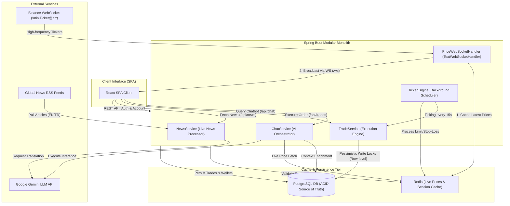

# CryptFlow
## Decoupled Paper-Trading Simulator & AI Market Analytics System

This project was developed as a core deliverable for the i2i Academy Internship Program. CryptFlow is a high-performance, decoupled paper-trading web application that allows users to simulate cryptocurrency trading using virtual USD balances, track portfolio performance metrics, and receive context-aware market analytics powered by Large Language Models (LLMs).

---

## Technical Stack

The platform is designed as a decoupled system featuring a React Single Page Application (SPA) frontend and a Spring Boot modular monolith backend:

*   **Frontend SPA:** React (Vite-powered compiler), JavaScript, Tailwind CSS styling, `i18next` translation framework, Lightweight Charts for price history visualization, and `react-markdown` for LLM rendering.
*   **Backend Core:** Java 21, Spring Boot 3.4.1 (Web, WebFlux, WebSocket, Data JPA).
*   **Persistent Storage:** PostgreSQL 16 database utilizing Flyway migrations for schema management.
*   **High-Performance Cache:** Redis (Spring Data Redis) for session/token validation and high-frequency price updates.
*   **Real-time Streaming:** Native Spring WebSockets with custom session decorators to broadcast live price tickers.
*   **Generative AI Pipeline:** Google Gemini API integrated directly via WebFlux `WebClient` for contextual prompt orchestration.

---

## System Architecture & Data Flow

The following architecture diagram details the ingestion, caching, transactional execution, and AI inference paths within the system:



### Flow Breakdown

1.  **High-Frequency Data Ingestion:**
    The backend establishes a persistent WebSocket connection to the external **Binance WebSocket Stream** (subscribing to `!miniTicker@arr`). The custom `PriceWebSocketHandler` parses incoming JSON payloads, updates the **Redis Cache** in-memory price hash (`market:prices`), and broadcasts the prices to all active **React SPA** clients using a non-blocking WebSocket stream (`/ws`).
2.  **Concurrency-Safe Session Caching:**
    Upon user authentication, session metadata and tokens are generated and cached in **Redis** with a 24-hour Time-to-Live (TTL). Subsequent client requests validate tokens against Redis, preventing database roundtrips for authentication.
3.  **Low-Latency Price Queries:**
    All public endpoints querying the latest asset prices fetch directly from the **Redis Cache** instead of executing SQL queries against the relational database, ensuring sub-millisecond response times.
4.  **ACID-Compliant Transactional Trading:**
    Order execution demands strict transactional boundaries. When executing buys or sells, the **Trade Execution Engine** obtains row-level database locks (`PESSIMISTIC_WRITE`) on the user's `Wallet` and `PortfolioAsset` rows within PostgreSQL. This prevents double-spending and ensures consistent updates.
5.  **LLM Prompt Orchestration:**
    The chatbot gathers user portfolio state and recent transaction history from **PostgreSQL**, queries the latest prices from **Redis**, and injects these metrics into a structured prompt layout. This enriched payload is transmitted to the **Google Gemini API**, returning context-aware summaries.

---

## Architectural & Functional Details

### 1. Robust WebSocket Connection Management
*   **Decorated Session Handling:** Spring WebSocket sessions are wrapped in a thread-safe `ConcurrentWebSocketSessionDecorator`. The system implements backpressure controls by specifying a 10-second send time limit and a 512KB buffer limit. If a slow client exceeds these limits, messages are dropped to preserve application thread integrity.
*   **Stale Connection Detection:** The backend monitors stream activity. If no data arrives from Binance within a specified window, the connection is considered stale and automatic reconnects are triggered.

### 2. Concurrency Control and Pessimistic Locking
*   **Race Condition Mitigation:** Multiple API requests or background order processing operations executing trade tasks for the same user wallet are serialized at the database level.
*   **Implementation:** Using Hibernate's row locking mechanism:
    ```java
    @Lock(LockModeType.PESSIMISTIC_WRITE)
    @Query("SELECT w FROM Wallet w WHERE w.userId = :userId")
    Optional<Wallet> findByUserIdForUpdate(@Param("userId") UUID userId);
    ```
    This lock delays concurrent transactions until the current trade commits, guaranteeing ACID properties under high load.

### 3. Background Ticker Engine & Automated Order Matcher
*   **Ticker Engine Loop:** A scheduler annotated with `@Scheduled` runs every 15 seconds. It generates realistic simulated price fluctuations when local simulation mode is active, writes price history snapshots to PostgreSQL, and invokes the alert/order processors.
*   **Automated Limit & Stop-Loss Execution:** The background scheduler pulls all pending (`PENDING`) limit and stop-loss orders from PostgreSQL. It compares target execution thresholds against the latest price data cached in Redis:
    *   *Limit Buy:* Executes when the current price is less than or equal to the target price.
    *   *Limit Sell:* Executes when the current price is greater than or equal to the target price.
    *   *Stop-Loss Sell:* Executes when the current price drops below or meets the target price.
    Upon triggering, it initiates transactional trade completion and updates the order status to `EXECUTED`.

### 4. Dynamic News Translation with Resilient Fallback
*   **Dynamic Language Detection:** The `/api/news` REST endpoint evaluates the user's active interface language (`?lang=tr` or `?lang=en`).
*   **Contextual Translation Pipeline:** Instead of displaying different news feeds for different languages, the system maintains consistent coverage by translating primary English feeds (CoinDesk & Cointelegraph) into Turkish on-the-fly using the **Google Gemini LLM**.
*   **Caching Strategy:** To optimize latency and mitigate LLM rate limits, the translated articles are cached in-memory with a 5-minute TTL.
*   **Resilient Fallback Routing:** If the Gemini API is unreachable, times out, or encounters rate limits, the `NewsService` catches the exception and falls back to fetching and parsing Turkish RSS feeds (KoinFinans and Investing.com TR) directly.

### 5. LLM Prompt Orchestration & Contextual Guardrails
*   **Data Injection:** Prompt orchestration extracts user balances, portfolio holdings, current market valuations, and recent transaction history, injecting them into a strict system instruction wrapper.
*   **Contextual Safety Guardrails:** The system prompt instructs the model to answer queries strictly regarding the provided account details and crypto markets. If the LLM generates a response without a disclaimer, the backend intercepts the text and appends: *"Educational purposes only — not financial advice."*
*   **Error Isolation:** All LLM integrations run inside protected try-catch contexts. If the external API fails, the backend immediately responds with a structured `503 Service Unavailable` JSON payload rather than blocking thread resources.

---

## Database Migrations (Flyway)

The PostgreSQL schema is evolved incrementally via Flyway migration scripts located in `src/main/resources/db/migration`:

| Version | Migration Script | Purpose |
|---|---|---|
| `V1` | `V1__initial_schema.sql` | Establishes `users`, `wallets`, `portfolio_assets`, and `trade_transactions` tables. |
| `V2` | `V2__add_new_symbols.sql` | Adds CHECK constraints defining the initial supported symbols. |
| `V3` | `V3__remove_symbol_constraints.sql` | Drops static constraints to support dynamic Binance symbols. |
| `V4` | `V4__widen_symbol_column.sql` | Expands symbol VARCHAR width to support longer Binance trade pairs. |
| `V5` | `V5__increase_price_precision.sql` | Alters price columns to `NUMERIC(28,8)` to support high-precision low-value assets. |

---

## Environment Variables

Configuration parameters are externalized and managed using environment variables. Fill in these keys inside your local `.env` file:

| Variable | Default Value | Description |
|---|---|---|
| `POSTGRES_DB` | `cryptflow` | PostgreSQL database name |
| `POSTGRES_USER` | `cryptflow` | PostgreSQL database username |
| `POSTGRES_PASSWORD` | `change-me` | PostgreSQL database password |
| `SPRING_DATASOURCE_URL` | `jdbc:postgresql://postgres:5432/cryptflow` | JDBC target connection URL |
| `SPRING_DATA_REDIS_HOST` | `redis` | Redis server hostname |
| `SPRING_DATA_REDIS_PORT` | `6379` | Redis server port |
| `SESSION_TTL_HOURS` | `24` | Token validation session TTL in Redis |
| `FRONTEND_ORIGINS` | `http://localhost:5173` | Allowed CORS origins for backend WebMvc configuration |
| `GEMINI_API_KEY` | *(Required)* | Google Gemini API credential token |
| `GEMINI_MODEL` | `gemini-3.1-flash-lite` | Model identifier for prompt processing |
| `TICKER_INTERVAL_MS` | `15000` | Ticker engine frequency limit |

---

## Local Development and Deployment

### Full Dockerized Setup (Recommended)
Confirm that Docker Engine and Docker Compose are installed on your target machine.

1.  Clone the repository and copy the environment template:
    ```bash
    cp .env.example .env
    ```
2.  Configure your `GEMINI_API_KEY` in the newly created `.env` file.
3.  Build and run the system container group:
    ```bash
    docker compose up -d --build
    ```
    *This command compiles the Spring Boot backend, starts PostgreSQL and Redis, applies Flyway migrations, and launches the API.*
    * **Backend Endpoint:** `http://localhost:8080`
    * **Interactive API Documentation:** `http://localhost:8080/swagger-ui.html`

4.  Install dependencies and start the React client:
    ```bash
    cd frontend
    npm install
    npm run dev -- --port 5173
    ```
    * **Frontend URL:** `http://localhost:5173`

### Running Tests
*   **Backend Tests (Unit & Integration):**
    ```bash
    cd backend
    ./mvnw clean test
    ```
*   **Frontend Tests:**
    ```bash
    cd frontend
    npm run test
    ```
