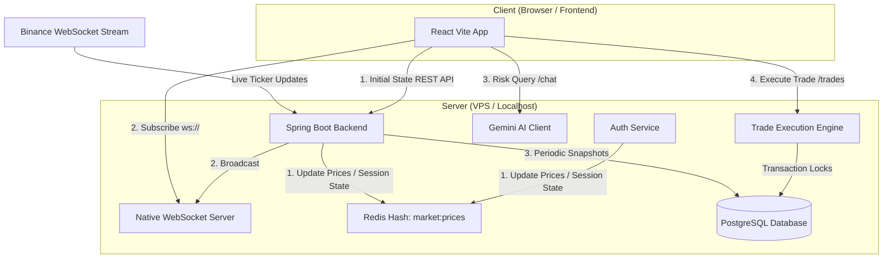

# CryptFlow 🚀
### Paper Trading & AI Market Assistant

> [!NOTE]
> This project has been developed as part of the **i2i Academy Internship Program** as a paper-trading web application allowing users to simulate real-time cryptocurrency trading using a virtual USD balance, complete with generative AI market insights.

---

## 🏛️ Tech Stack

The application is built on a high-performance, modular, and scalable architecture:

- **Frontend:** React, Vite, JavaScript, Tailwind CSS, `i18next` (Internationalization), `react-markdown`
- **Backend:** Java 21, Spring Boot 3 (Modular Monolith)
- **Database & Migration:** PostgreSQL + Flyway (Database schema migration manager)
- **Caching & Session Storage:** Redis (Stores user sessions and active live prices)
- **Live Stream:** Native WebSockets (`/ws` endpoint using custom Spring `TextWebSocketHandler`)
- **Generative AI:** Google Gemini API (Powering the conversational chatbot assistant and portfolio summary insights)

---

## 📊 Architecture & Data Flow

The following diagram illustrates how live market data flows from Binance down to the PostgreSQL database and React frontend, alongside the transaction and chat execution paths:



### Flow Breakdown

1. **Initial State (REST API):**
   Upon startup, the **React Vite App** fetches the initial market prices and user authentication states from the **Spring Boot Backend** REST endpoints. Simultaneously, the backend pulls active market listings and prices directly from the Binance REST API.

2. **Real-time Price Capture & Caching:**
   The backend establishes a persistent connection to the external **Binance WebSocket Stream** to receive real-time ticker updates. The **Auth Service** and backend components continuously update the token price states and user sessions inside the **Redis Cache** (using the `market:prices` hash) to minimize database load.

3. **WebSocket Broadcasting:**
   The backend processes and broadcasts incoming price updates through the **Native WebSocket Server** (`/ws` endpoint). The frontend client opens a raw WebSocket connection to receive these real-time price updates immediately.

4. **Gemini AI Market Assistant:**
   User queries regarding portfolio health, historical performance, and contextual market analysis are sent to the **Gemini AI Client** via the `/api/chat/query` endpoint to get instant, context-aware financial advice.

5. **Historical Snapshots:**
   The backend periodically writes historical price snapshots from Redis into the **PostgreSQL Database** for charting and audit logs.

6. **Pessimistic Trade Execution:**
   When a user clicks "Execute Order", a trade request is sent to the **Trade Execution Engine**. The engine locks the user's wallet and asset rows in the **PostgreSQL Database** using a **pessimistic write lock** (`PESSIMISTIC_WRITE`) within a single transactional block to prevent race conditions or double-spending.

---

## ✨ Key Features

### 1. Dynamic Binance Integration & Live Streams 📈
* **Dynamic Asset Listing:** At startup, the application fetches all active `USDT` trading pairs directly from the Binance REST API (`https://api.binance.com/api/v3/ticker/price`) to populate the system dynamically.
* **WebSocket Price Stream:** Subscribes to the global Binance `!miniTicker@arr` WebSocket channel. Received price ticks are cached in Redis and streamed instantly to all connected clients via native WebSockets.
* **Stream Health Monitoring (Stale Connection Detection):** If the WebSocket connection is interrupted, the system automatically detects the stale state and schedules reconnects every 5 seconds.

### 2. 30-Second Price Locking (Price Lock) ⏳
* The moment a user opens the buy/sell trade modal, the active coin price is **locked for 30 seconds**.
* A flashing countdown timer is displayed inside the modal indicating the remaining time.
* Once the 30-second timer hits zero, the locked price expires, the **"Execute Order" button is automatically disabled**, and the user is notified that the price lock is no longer valid.

### 3. Favorites System & Status Dropdown 💖
* Market cards feature heart toggle buttons in their top-right corner to add/remove coins from favorites. The state is persisted in `localStorage`.
* A Heart button next to the profile icon in the header opens a dedicated **Favorites Dropdown Window** displaying live prices and percent changes for all favorited assets.
* Clicking any favorited asset inside the dropdown immediately opens its trading modal.
* The header heart icon utilizes a breathing/pulsing red dot badge instead of a raw counter for a premium aesthetic.

### 4. Gemini AI Chatbot Widget 🤖
* A chat widget in the bottom-right corner integrates the Google Gemini API.
* The assistant automatically analyzes the user's active portfolio allocation, trade transaction history, and current market feeds to provide contextual investment summaries and answers.
* Supports rich Markdown formatting for all chat replies.

### 5. Multilingual Support (TR / EN i18n) 🌐
* The application supports bilingual (Turkish and English) localization powered by `react-i18next`.
* Language configuration can be swapped instantly within the Account Settings (Profile Modal) page.

### 6. Premium Dark Glassmorphic Design 🎨
* Curated dark color scheme matching the custom brand logo.
* Premium micro-animations, glassmorphic card overlays, and clean layouts.
* Login page features an infinite vertical scrolling marquee ticker showing 9 randomly selected coins from the live stream.

---

## 🗄️ Database Migrations (Flyway)

The database schema is managed incrementally through Flyway migrations:

| Version | Migration Purpose | Description |
|---|---|---|
| `V1__initial_schema.sql` | Base Schema | Creates User, Wallet, Portfolio Assets, and Trade Transactions tables. |
| `V2__add_new_symbols.sql` | Symbol CHECK Constraints | Adds database-level constraints specifying supported asset symbols. |
| `V3__remove_symbol_constraints.sql` | Dynamic Symbols Support | Removes the hardcoded CHECK constraints to allow dynamic Binance symbols. |
| `V4__widen_symbol_column.sql` | Symbol Column Expansion | Widens the `symbol` columns to `VARCHAR(50)` to accommodate long Binance trade symbols. |
| `V5__increase_price_precision.sql` | Decimal Precision Expansion | Expands column definitions (`price_usd` and `unit_price_usd`) to `NUMERIC(28,8)` to prevent rounding cheap assets (e.g. SHIB) to 0. |

---

## ⚙️ Environment Variables

Copy the root `.env.example` file to `.env` and fill in your values.

| Variable Name | Default Value | Description |
|---|---|---|
| `POSTGRES_DB` | `cryptflow` | PostgreSQL database name |
| `POSTGRES_USER` | `cryptflow` | PostgreSQL username |
| `POSTGRES_PASSWORD` | `change-me` | PostgreSQL user password |
| `SPRING_DATASOURCE_URL` | `jdbc:postgresql://postgres:5432/cryptflow` | JDBC datasource URL |
| `SPRING_DATA_REDIS_HOST` | `redis` | Redis server hostname |
| `SPRING_DATA_REDIS_PORT` | `6379` | Redis server port |
| `SESSION_TTL_HOURS` | `24` | User session TTL in Redis (Hours) |
| `FRONTEND_ORIGINS` | `http://localhost:5173` | Allowed CORS origins (comma-separated) |
| `GEMINI_API_KEY` | *(Empty)* | Google Gemini API key |
| `GEMINI_MODEL` | `gemini-3.1-flash-lite` | Active Gemini API model |
| `TICKER_INTERVAL_MS` | `15000` | Price update loop interval (Milliseconds) |

---

## 🛠️ Installation and Setup

### Full Containerized Setup (Recommended)
Ensure Docker/Docker Compose and Node.js (v20+) are installed.

1. Create your `.env` configuration file:
   ```bash
   cp .env.example .env
   ```

2. Spin up the backend, database, and caching servers:
   ```bash
   docker compose up -d --build
   ```
   *This starts Postgres, Redis, and the Spring Boot API, automatically applying all database schema migrations via Flyway.*
   * **Backend API Base URL:** `http://localhost:8080`
   * **Swagger UI Documentation:** `http://localhost:8080/swagger-ui.html`

3. Start the React frontend application:
   ```bash
   cd frontend
   npm install
   npm run dev -- --port 5173
   ```
   * **Frontend Application URL:** `http://localhost:5173`

---

## 🧪 Testing and Production Build

* **Run Backend Unit & Integration Tests:**
  ```bash
  cd backend
  ./mvnw clean test
  ```

* **Build Frontend for Production:**
  ```bash
  cd frontend
  npm run build
  ```

---

## 🔒 Security Notice
Never commit local `.env` files, actual API keys, or PDFs containing sensitive project credentials to version control. These patterns are automatically excluded via `.gitignore`.
