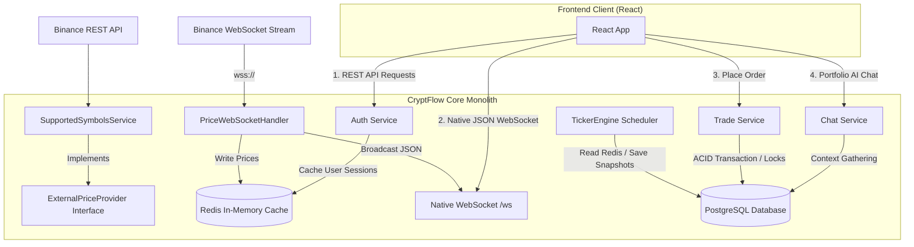
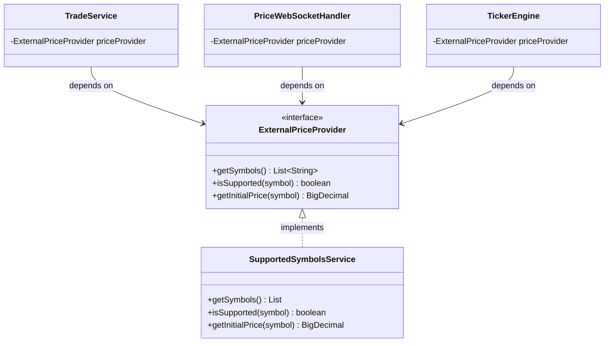
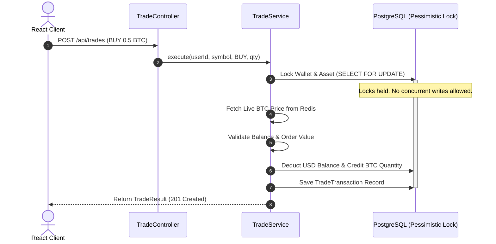
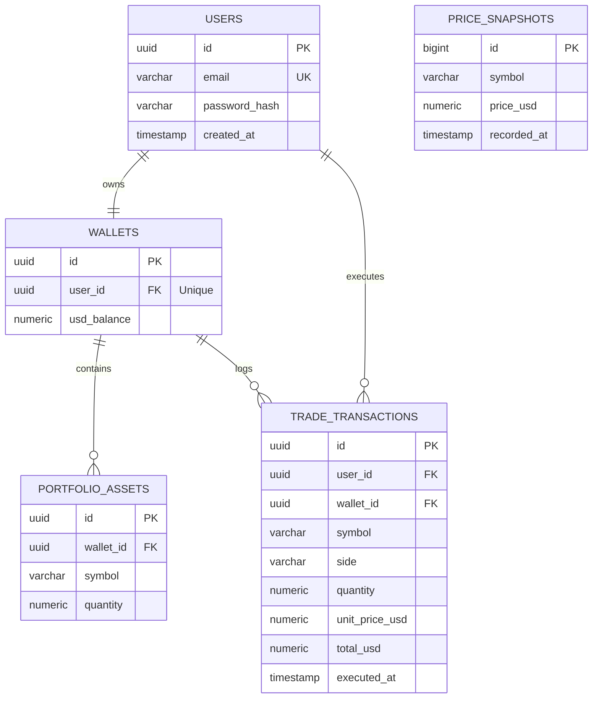
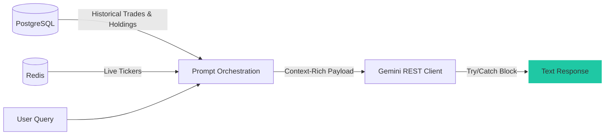

# CryptFlow - Technical Architecture & System Design Document

This document provides a detailed breakdown of the system architecture, data flow paths, database layout, and decoupling interfaces for the CryptFlow platform.

---

## 1. Architectural Design Overview

CryptFlow uses a feature-oriented modular monolith on the backend with a standalone Single-Page Application (SPA) on the frontend. The system ingests live market prices and executes paper trades in an ACID-compliant environment.



---

## 2. Ingestion & Decoupling Layer (Section 5.3)

The `ExternalPriceProvider` interface decouples supported-symbol discovery and initial-price lookup from consumers such as trading, orders, alerts, chat, and the ticker task. `SupportedSymbolsService` is the current live Binance-backed implementation; the repository does not contain a simulated-price implementation.

### Ingestion Interface Code Contract:
```java
package com.i2i.cryptflow.shared.model;

import java.math.BigDecimal;
import java.util.List;

public interface ExternalPriceProvider {
    List<String> getSymbols();
    boolean isSupported(String symbol);
    BigDecimal getInitialPrice(String symbol);
}
```

### Dependency Decoupling Diagram:


---

## 3. Core Modules & Business Logic

### 3.1. Authentication & Session Module (`com.i2i.cryptflow.auth`)
* **State Isolation:** User credentials and hashes are stored in PostgreSQL, while active session tokens are cached in Redis with a configurable Time-to-Live (24 hours by default).
* **Initial Provisioning:** Upon user registration, a randomized starting balance (between `$10,000` and `$20,000`) is credited using a cryptographically secure random generator (`SecureRandom`).

### 3.2. Order Execution Engine (`com.i2i.cryptflow.trade`)
To ensure transactional integrity and avoid double-spending or balance mismatch, all buy and sell actions are wrapped inside database transactions using pessimistic write locks.



---

## 4. Storage Architecture & Schema Design

### 4.1. Cache Layer (Redis)
* **`session:<token>` (String):** Maps an opaque session token to a user UUID until its TTL expires.
* **`market:prices` (Hash):** Stores the latest ticker prices mapped to coin symbols. Live WebSocket messages update entries as data arrives; the configurable ticker interval controls database snapshots and order/alert processing.

### 4.2. Core Database Schema (PostgreSQL)


Flyway also manages `equity_history`, `limit_orders`, and `price_alerts`; see `backend/src/main/resources/db/migration` for the complete executable schema.

---

## 5. LLM Diagnostics Pipeline (`com.i2i.cryptflow.chat`)

The Gemini integration operates strictly on-demand. When a request is made, a context-rich prompt is assembled by combining permanent financial records with temporary caching data.



* **Exception Fallback:** Gemini calls use a bounded synchronous wait. Missing configuration, network failures, timeouts, and invalid model responses become a structured `ApiException` with HTTP `503 Service Unavailable`.
